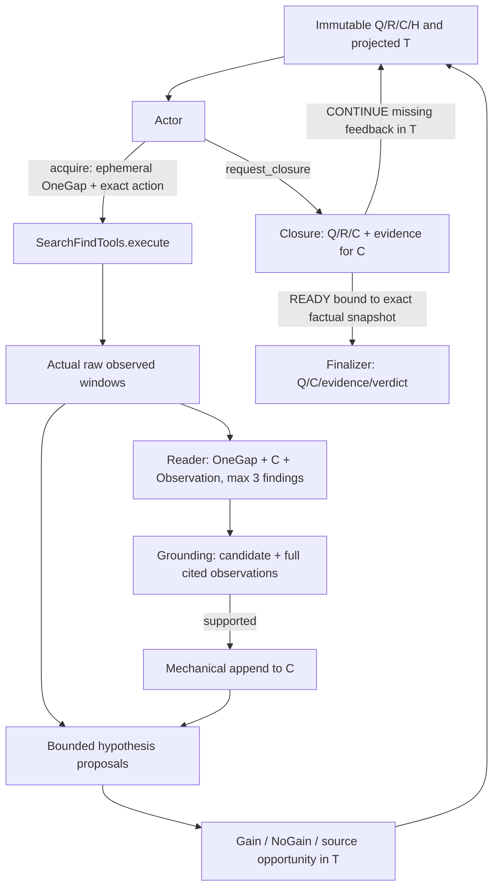

# Clean Recoverable Loop: architecture

## Boundary and entry points

Based on Stage 4 `7fdb048e856545facd4acfb590e8cf28c46f1013`.
The design audit was committed first as `ea2ce2fd`. New implementation lives in
`llm_chat/recoverable_loop/`; existing retriever, localizer, schemas and historical
experiment files are unchanged. This delivery has no live semantic transport.
`SemanticPort.complete(RoleRequest)` is explicitly injected; tests use scripts.

## Modules

| Module | Responsibility |
|---|---|
| `contracts.py` | Embed actual tool schema; strict JSON and existing-handle validation; no action repair |
| `state.py` | Frozen Q/R/C/H/T records, original-Q span anchors, trace hash chain and TraceView |
| `tools.py` | Exact executor dispatch; pin document identity; archive immutable observed spans |
| `roles.py` | Narrow role prompts/schemas and serialized, copied role requests |
| `engine.py` | Explicit role order, selective claim commits, bounded H transitions, feedback and Closure permit |
| `replay.py` | Reconstruct state/evidence from append-only records without tool/model execution |

No model receives a generic state patch interface. Q/R are never rewritten by the
loop. R contains only IDs and source spans. C contains ID, statement, observed
references and version. H has tentative statement/status/basis references; at most
six active H. OneGap exists in one Actor decision and the Reader call, and in T
as historical data. It has no active persistent slot or truth authority.

## Evidence and permissions

The evidence archive is raw Workspace storage, not a semantic progress state.
Document IDs, byte hashes, offsets, exact text, titles, URLs, window aliases and
attempt IDs are mechanical. Grounding selects complete cited observed windows,
including real titles and raw headers/context; no synthetic excerpt package.
Reader is capped at three candidates **per acquisition**, even when search
returns several windows. Grounding does not see Q/R/H/OneGap or previous C.
Current candidates must cite windows from this acquisition. Reusing earlier
facts is done through C; a new conjunctive claim cannot silently treat C as raw
new evidence. Cross-step evidence synthesis is deliberately limited in this v1.

H may be added, kept, deprioritized or rejected. Rejection needs observed refs;
NoGain alone supports deprioritization, not factual negation. Changes are validated
atomically and cannot write C. Role input JSON is copied and immutable to the
caller; these are application permissions, not a sandbox against malicious Python.

## Feedback and recovery

Gain is derived from actual accepted C, exact-nonduplicate H, an active H being
lowered, or a newly discovered uninspected source nominated as useful. Raw new D/W
alone is not Gain. Conflict resolution counts through supported C/H changes;
there is no conflict graph. Claim usefulness and semantic H novelty still depend
on the Reader/H manager. True but irrelevant claims can mask poor exploration;
all deltas are logged for independent review.

TraceView includes the last three outcomes, consecutive NoGain for a mechanical
family `(R ID, strategy, sorted H IDs)`, uninspected nominated sources, and latest
Closure feedback. Query paraphrase does not reset that family. Labels are only a
coarse signal: semantic route identity and feedback staleness need live review.
After any Find/Open on a nominated source it leaves the pending list, including a
Find miss; that does not assert the source is exhausted or irrelevant.

CONTINUE enters T only. It is an allowed, potentially costly research decision.
Only READY grants a one-use finalization permit, tied to current Q/R/C/evidence.
Any subsequent Actor attempt invalidates it; finalization failures consume it.
Finalizer cannot see H, OneGap, Trace or inferred residuals. False READY and
unsupported final prose remain semantic risks; citations alone cannot certify
entailment.

## Logs and failures

Role requests, raw outputs, actual tool observations, verdict bindings and state
deltas are append-only JSONL. Every event includes a sequence/hash predecessor.
Malformed outputs are retained, not fixed, retried or re-sampled. Tool or role
failure ends that step; already verified C survives a later H failure. A runner
may terminate the trajectory according to its frozen policy. No retries exist
inside this loop.

`replay_log()` verifies the hash chain and matching supported-verdict/evidence
links before restoring commits. It restores Q/R/C/H/T and observed evidence, not
a READY capability or the original full corpus. Hash chains detect accidental
edits, not adversarial rewriting/signatures. Live continuation additionally needs
original documents pinned to their recorded hashes and a hydrated handle registry.
